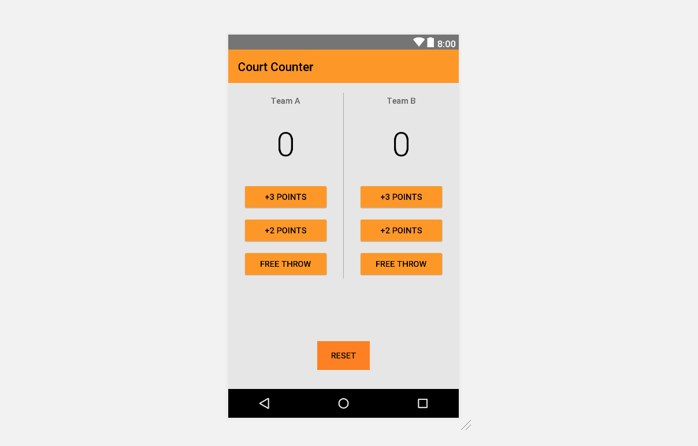

# CourtCounter_Android

Court Counter Sample App
======================

Keeps track of basketball scores for two teams. 
Pre-requisites
--------------

- Android SDK v24
- Android Build Tools v24.0.2
- Android Support Repository v24.2.0

Getting Started
---------------

This sample uses the Gradle build system. To build this project, use the
"gradlew build" command or use "Import Project" in Android Studio.
